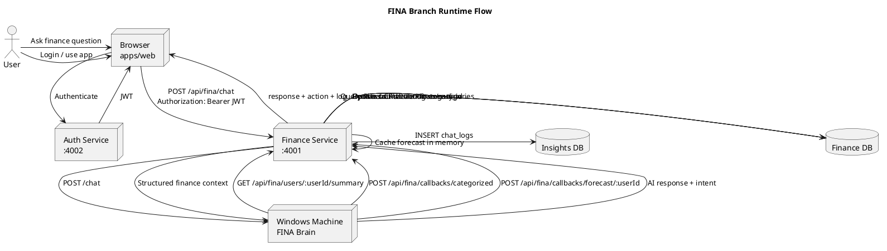
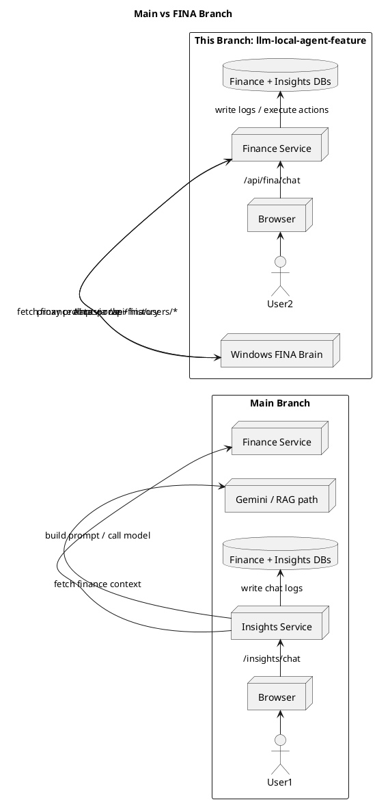
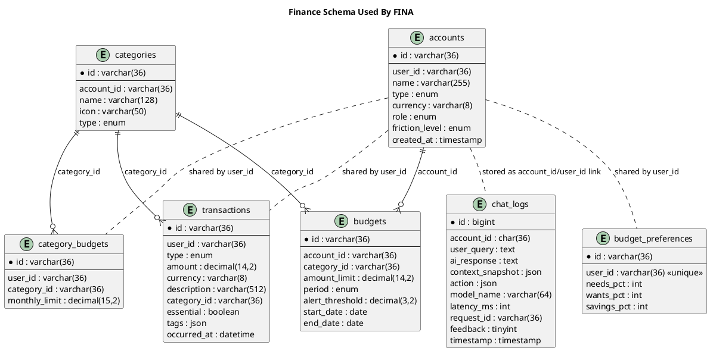

# FINA Branch Summary

## Branch Identity

- Branch: `llm-local-agent-feature`
- Core idea: this branch does not just "improve chat". It changes the AI integration model so the finance service becomes the bridge between the web app and a separate Windows-hosted local agent called `FINA Brain`.
- Main branch baseline: the `insights` service owns AI chat at `/insights/chat` and uses its own RAG/Gemini-style pipeline.
- This branch: the finance service adds `/api/fina/*`, proxies chat/dashboard requests to FINA on Windows, exposes finance-data endpoints for FINA to pull from, and receives AI callback results from FINA.

## Top-Down Architecture

At a high level, the system is still a Bun/Turborepo monorepo with:

- `apps/web`: React + Vite frontend
- `services/auth`: authentication service
- `services/finance`: finance CRUD service
- `services/insights`: older AI/RAG service
- MySQL databases: `auth`, `finance`, `insights`

The branch introduces a new split of responsibility:

1. The browser still authenticates through `auth`.
2. The browser still uses finance CRUD endpoints for accounts, categories, budgets, and transactions.
3. For AI chat and AI dashboard, the browser now talks to `services/finance` at `/api/fina/*`.
4. `services/finance` then talks outward to the Windows-side FINA Brain through `FINA_API_URL`.
5. FINA Brain also calls back into finance to fetch structured user data and to push results like categorization and forecast payloads.

That makes `services/finance` the integration hub for both:

- normal finance CRUD
- AI-facing data APIs for FINA
- AI chat proxying
- action execution from chat prompts
- log persistence into the `insights` database

## What Changed On This Branch

### 1. Finance service gained a FINA integration layer

New files:

- `services/finance/src/controllers/fina.controller.ts`
- `services/finance/src/lib/fina-client.ts`
- `services/finance/src/lib/action-executor.ts`

Bootstrapping changed in:

- `services/finance/src/index.ts`
- `services/finance/src/env.ts`

The finance service now does four jobs:

1. Serve FINA-facing read APIs such as:
   - `GET /api/fina/users/:userId`
   - `GET /api/fina/users/:userId/accounts`
   - `GET /api/fina/users/:userId/transactions`
   - `GET /api/fina/users/:userId/summary`
   - `GET /api/fina/users/:userId/spending/daily`
   - `GET /api/fina/users/:userId/spending/monthly-history`
   - `GET /api/fina/categories`
2. Accept FINA callbacks:
   - `POST /api/fina/callbacks/categorized`
   - `POST /api/fina/callbacks/forecast/:userId`
3. Proxy authenticated chat/dashboard from frontend to Windows FINA:
   - `POST /api/fina/chat`
   - `GET /api/fina/dashboard`
   - `GET /api/fina/logs`
   - `PATCH /api/fina/logs/:logId/feedback`
4. Execute simple CRUD actions inferred from chat prompts:
   - create/update/delete transactions
   - create/update/delete budgets

### 2. Frontend "insights" path was rerouted

`apps/web/src/services/insights.ts` no longer points to the old insights service by default.

Before:

- default base was `http://localhost:4004`
- frontend called `/insights/chat`

On this branch:

- default base is `http://localhost:4001`
- frontend calls `/api/fina/chat`
- frontend also calls `/api/fina/logs`, `/api/fina/dashboard`

In dev mode, `apps/web/vite.config.js` now proxies `/api/fina` directly to the finance service.

### 3. Database schema was extended to support FINA-oriented behavior

Finance schema additions:

- `accounts.role`
- `category_budgets`
- `budget_preferences`

Finance schema adjustment:

- `transactions.essential` changed to nullable boolean-style definition

Insights schema is reused for logging:

- `chat_logs` stores AI response, action payload, latency, request id, feedback, and context snapshot

### 4. The old insights service still exists, but is no longer the main chat path for this branch

The old path is still implemented in `services/insights`, but the web app on this branch effectively bypasses it for user-facing chat.

That is the architectural difference that matters most for your report:

- `main`: `web -> insights service -> model/RAG -> finance APIs`
- `llm-local-agent-feature`: `web -> finance service -> Windows FINA Brain`

## Runtime Flow

### User-facing flow on this branch

1. User logs in through `auth`.
2. User gets/uses JWT.
3. User performs standard CRUD against finance endpoints.
4. User opens chat page.
5. Frontend sends chat request to `POST /api/fina/chat` on finance.
6. Finance resolves `userId` from JWT.
7. Finance loads account role from the finance DB.
8. Finance sends prompt + role + history to FINA Brain on Windows.
9. Finance optionally runs `executeFromPrompt(...)` to make direct DB changes.
10. Finance inserts the chat log into the `insights.chat_logs` table.
11. Finance returns reply, action result, and log metadata to the frontend.

### Machine-to-machine flow with Windows FINA

1. FINA Brain pulls finance data from `/api/fina/users/:userId/...`
2. FINA Brain performs its own AI logic externally
3. FINA Brain can push results back through callback endpoints
4. Finance stores forecast in memory and updates categories in DB when categorization callback arrives

## Database Schema

### Finance DB

#### `accounts`

Purpose:

- user-owned finance account records
- now also stores user persona needed by FINA

Important fields:

- `id`
- `user_id`
- `name`
- `type`
- `currency`
- `role` (`Student`, `Worker`, `Freelancer`, `Parent`, `Retiree`)
- `friction_level`
- `created_at`

Branch significance:

- `role` is new and is used when finance calls `fina.chat(...)` and `fina.dashboard(...)`

#### `transactions`

Purpose:

- raw income/expense ledger

Important fields:

- `id`
- `user_id`
- `type`
- `amount`
- `currency`
- `description`
- `category_id`
- `essential`
- `tags`
- `occurred_at`

Branch significance:

- this table is the main source for FINA summaries, daily spend series, recurring detection, and action execution

#### `categories`

Purpose:

- category master data for income/expense grouping

Important fields:

- `id`
- `account_id`
- `name`
- `icon`
- `type`
- `created_at`

Branch significance:

- FINA categorization callback maps category names back to `category_id`
- category names are also used in summary generation and recurring pattern detection

#### `budgets`

Purpose:

- existing budget table for overall or per-category budget windows

Important fields:

- `id`
- `account_id`
- `category_id`
- `amount_limit`
- `period`
- `alert_threshold`
- `start_date`
- `end_date`
- `created_at`

Branch significance:

- still used by standard CRUD
- summary endpoint now computes actual-vs-limit budget status for FINA

#### `budget_preferences`

Purpose:

- stores user-level needs/wants/savings percentages

Important fields:

- `user_id`
- `needs_pct`
- `wants_pct`
- `savings_pct`

Branch significance:

- drives the 50/30/20-style budget summary returned to FINA

#### `category_budgets`

Purpose:

- stores per-user monthly limits per category

Important fields:

- `user_id`
- `category_id`
- `monthly_limit`
- unique key on `(user_id, category_id)`

Branch significance:

- used by `/api/fina/users/:userId/category-budgets`
- included in computed summary status for AI consumption

### Insights DB

#### `chat_logs`

Purpose:

- persistent log of chat interactions and feedback

Important fields:

- `account_id`
- `user_query`
- `ai_response`
- `context_snapshot`
- `action`
- `model_name`
- `latency_ms`
- `request_id`
- `feedback`
- `timestamp`

Branch significance:

- finance writes directly into this table using a separate MySQL pool
- the old insights service is not required to log chats on this branch

## PlantUML Diagrams

### 1. Current branch runtime architecture

### 2. Difference from main branch

### 3. Finance data model relevant to FINA

## Why This Branch Is Architecturally Different

This branch is different in system shape, not only in implementation detail.

On `main`, the AI feature lives mainly inside `services/insights`.

On `llm-local-agent-feature`, the AI feature is split across two runtimes:

- finance service inside the monorepo
- FINA Brain outside the monorepo on a Windows machine

That changes the system in four ways:

1. AI orchestration moves from `insights` to `finance`.
2. The finance service becomes both an internal business API and an AI integration gateway.
3. There is now a cross-machine dependency through `FINA_API_URL`.
4. Some state is now hybrid:
   - persistent in MySQL
   - transient in finance memory (`forecastCache`)

## Notable Limitations / Missing Pieces

These are worth mentioning in the report because they affect completeness.

### Missing or incomplete features

- `GET /api/fina/users/:userId/goals` is a stub and always returns an empty list.
- `GET /api/fina/users/:userId/accounts` returns `balance: 0`; real balance is not computed yet.
- forecast storage is only in an in-memory `Map`, so it is lost on restart and not shared across instances.
- FINA callbacks do not appear to have authentication or signature verification.
- The FINA read endpoints under `/api/fina/users/:userId/*` are not guarded by JWT middleware in this file.
- Finance writes directly to the `insights` database using raw SQL instead of going through the insights service or a shared repository layer.
- `chat_logs.account_id` is populated with `userId` in the finance FINA path, which is semantically different from the name `account_id`.
- The branch still keeps the old insights service in the repo, so there are now two AI approaches present at once.

### Design tradeoffs

- This branch is faster to integrate with a local Windows AI box because finance exposes exactly the data FINA needs.
- It also increases coupling because finance now knows about:
  - AI request format
  - AI action execution
  - AI logging
  - FINA-specific callback contracts
- That means the finance service is no longer purely a finance CRUD service.

## Short Report-Ready Conclusion

`llm-local-agent-feature` changes the project from a single in-repo AI architecture into a hybrid architecture where the finance service becomes an integration bridge to an external Windows-hosted local agent called FINA. The key branch changes are new FINA endpoints in the finance service, new schema support for user role and budget preference data, frontend rerouting from `/insights/*` to `/api/fina/*`, and direct chat log persistence into the insights database. Compared with `main`, this branch is not just a model swap; it introduces a new runtime boundary, new callback flows, and a different ownership model for AI orchestration.
